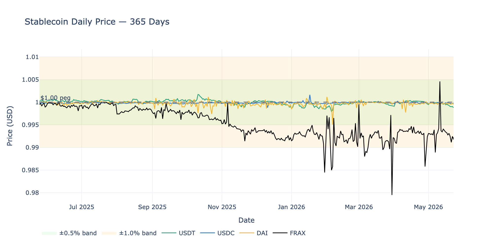
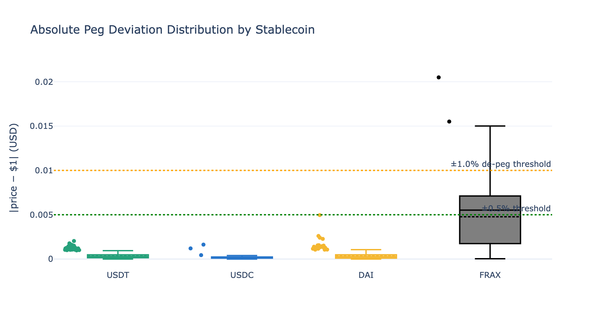
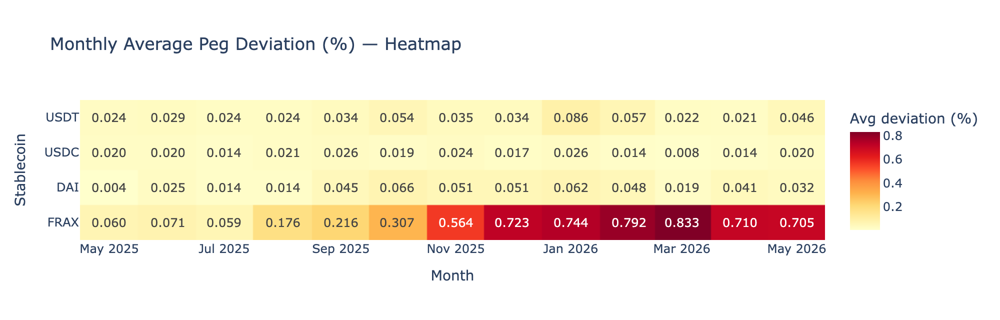
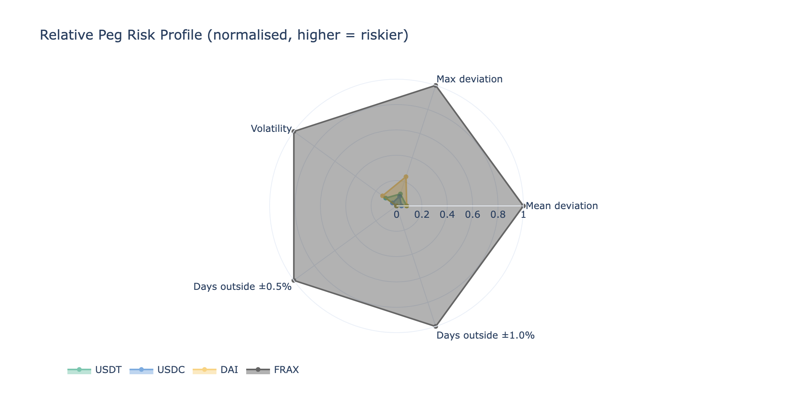

# Stablecoin Peg Stability & Risk Analysis
This research was created with the aim of finding the answer to the research question given below:
> **Research question:** How tightly do major stablecoins maintain their $1 peg, under what conditions do they deviate, and what does this imply for risk-aware capital allocation in DeFi?

---

## Overview

This project analyses 365 days of daily price data for four stablecoins with distinct collateralisation mechanisms:

| Stablecoin | Ticker | Mechanism |
|---|---|---|
| Tether | USDT | Fiat-collateralised (centralised) |
| USD Coin | USDC | Fiat-collateralised (centralised) |
| Dai | DAI | Crypto-collateralised (MakerDAO) |
| Frax | FRAX | Fractional-algorithmic (hybrid) |

Data is sourced from the [CoinGecko public API](https://www.coingecko.com/en/api) — no API key required.

---

## Key Findings

- **Fiat-collateralised stablecoins (USDT, USDC)** show the tightest day-to-day peg but carry **concentrated, discontinuous risk** a single counterparty/custodian failure can cause rapid de-pegs (e.g., USDC during the March 2023 SVB collapse, which resolved within ~72 hours).
- **DAI** exhibits slightly higher baseline deviation but its collateral ratios are fully on-chain and verifiable in real time, making it the **most observable** risk in the set.
- **FRAX**'s fractional mechanism shows the widest deviation distribution and introduces **reflexive risk**: its FXS collateral component can weaken precisely during market stress, amplifying de-peg potential at the worst moment.
- A **Kruskal–Wallis test** confirms the four deviation distributions are statistically distinct (p < 0.05) — each stablecoin warrants separate risk treatment in a portfolio, rather than being grouped as generic "$1 assets".

> A DeFi yielding book that treats all stablecoins as equivalent misprices risk. The analysis motivates disaggregating stablecoin exposure by mechanism and monitoring peg deviation as a real-time risk signal.

---

## Visualisations









| Chart | What it shows |
|---|---|
| Daily price time series | Price vs $1 peg with ±0.5% and ±1.0% bands highlighted |
| Deviation box plot | Distribution of `\|price − $1\|` per stablecoin with de-peg thresholds |
| Monthly deviation heatmap | How stress concentrates in specific calendar months |
| Risk radar chart | Normalised multi-metric risk profile across all four stablecoins |

---

## Methodology

1. **Data collection**  CoinGecko `/coins/{id}/market_chart` endpoint, daily interval, 365 days
2. **Cleaning** forward-fill for at most 1–2 isolated gaps (exchange non-reporting days)
3. **Deviation metric** `δ_t = |price_t − 1.00|`
4. **Risk metrics** mean/median/max deviation, volatility (σ), days outside ±0.5% and ±1.0% bands
5. **De-peg detection** flag days where `δ_t > 0.01`; classify as premium or discount
6. **Statistical tests** Kruskal–Wallis (global significance) + pairwise Mann–Whitney U

---

## Repository Structure

```
.
├── stablecoin_peg_analysis.ipynb   # Main analysis notebook
├── charts/                         # Exported PNG charts used in README
├── requirements.txt
├── .gitignore
└── README.md
```

---

## Setup

```bash
# 1. Create and activate a virtual environment
python -m venv .venv
source .venv/bin/activate          # Windows: .venv\Scripts\activate

# 2. Install dependencies
pip install -r requirements.txt

# 3. Launch Jupyter
jupyter notebook stablecoin_peg_analysis.ipynb
```

Run all cells top-to-bottom. The notebook fetches live data on execution — an internet connection is required. Total runtime is usually around 30–60 seconds, depending on CoinGecko public API rate limits. The visualisation cells also refresh the PNG files under `charts/` for this README.

---

## Dependencies

| Package | Purpose |
|---|---|
| `requests` | CoinGecko API calls |
| `pandas` | Data manipulation & aggregation |
| `numpy` | Numerical operations |
| `plotly` | Interactive visualisations |
| `kaleido` | Static PNG export for README charts |
| `scipy` | Kruskal–Wallis & Mann–Whitney tests |

Kaleido uses a local Chrome/Chromium browser for static image export.

---

## Author

**Engin Samet Dede**  
MSc Knowledge Engineering, University of Geneva  
MSc Mathematics, Computer Science & Digital Sciences, University of Geneva (double degree)  
[GitHub](https://github.com/Engn21)
